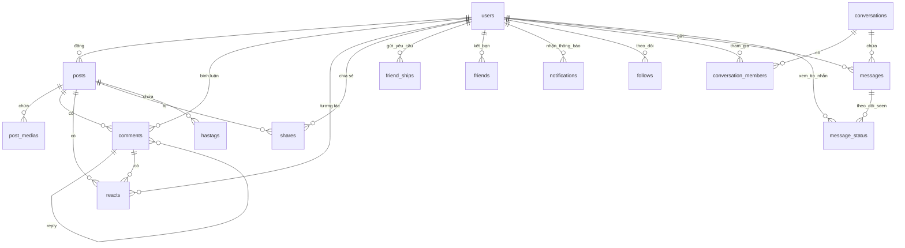

# THIẾT KẾ CHI TIẾT CƠ SỞ DỮ LIỆU (DATABASE SCHEMA) - DỰ ÁN DESMOS

Tài liệu này cung cấp chi tiết cấu trúc các bảng dữ liệu (Database Schema) và mã DDL SQL tương thích cho hệ quản trị cơ sở dữ liệu (MySQL / PostgreSQL). Các thiết kế này đồng bộ với các Java Entity hiện có trong dự án và bổ sung các bảng cho tính năng Theo dõi (Follow) và Chat (WebSocket).

---

## 1. SƠ ĐỒ QUAN HỆ THỰC THỂ (ERD - MERMAID DIAGRAM)



---

## 2. DDL SQL CHI TIẾT (MYSQL COMPATIBLE)

Dưới đây là tập lệnh SQL tạo bảng tương ứng với thiết kế thực tế:

```sql
-- 1. Bảng Users
CREATE TABLE users (
    id BIGINT AUTO_INCREMENT PRIMARY KEY,
    username VARCHAR(100) NOT NULL UNIQUE,
    email VARCHAR(150) NOT NULL UNIQUE,
    phone VARCHAR(20) NULL,
    password VARCHAR(255) NOT NULL,
    avata TEXT NULL,
    cover_photo TEXT NULL,
    bio TEXT NULL,
    dod DATETIME NULL, -- Ngày sinh (Date of Birth)
    gender VARCHAR(20) NULL, -- male, female, other
    role VARCHAR(20) NOT NULL DEFAULT 'user', -- admin, user, qtv
    is_verified BOOLEAN DEFAULT FALSE,
    is_active BOOLEAN DEFAULT TRUE,
    false_login INT DEFAULT 0,
    lock_until TIMESTAMP NULL,
    create_at TIMESTAMP DEFAULT CURRENT_TIMESTAMP,
    update_at TIMESTAMP DEFAULT CURRENT_TIMESTAMP ON UPDATE CURRENT_TIMESTAMP,
    delete_at TIMESTAMP NULL
);

-- 2. Bảng Posts
CREATE TABLE posts (
    id BIGINT AUTO_INCREMENT PRIMARY KEY,
    caption TEXT NULL,
    user_id BIGINT NOT NULL,
    privacy VARCHAR(20) NOT NULL DEFAULT 'globle', -- globle, only_me, friends
    status VARCHAR(20) NOT NULL DEFAULT 'published', -- draft, published, deleted
    create_at TIMESTAMP DEFAULT CURRENT_TIMESTAMP,
    update_at TIMESTAMP DEFAULT CURRENT_TIMESTAMP ON UPDATE CURRENT_TIMESTAMP,
    delete_at TIMESTAMP NULL,
    FOREIGN KEY (user_id) REFERENCES users(id) ON DELETE CASCADE
);

-- 3. Bảng Post Medias
CREATE TABLE post_medias (
    id BIGINT AUTO_INCREMENT PRIMARY KEY,
    post_id BIGINT NOT NULL,
    media_url TEXT NOT NULL,
    media_type VARCHAR(20) NOT NULL, -- image, video
    create_at TIMESTAMP DEFAULT CURRENT_TIMESTAMP,
    update_at TIMESTAMP DEFAULT CURRENT_TIMESTAMP ON UPDATE CURRENT_TIMESTAMP,
    FOREIGN KEY (post_id) REFERENCES posts(id) ON DELETE CASCADE
);

-- 4. Bảng Comments
CREATE TABLE comments (
    id BIGINT AUTO_INCREMENT PRIMARY KEY,
    content TEXT NOT NULL,
    user_id BIGINT NOT NULL,
    post_id BIGINT NOT NULL,
    comment_id BIGINT NULL, -- Tự tham chiếu để làm reply bình luận
    create_at TIMESTAMP DEFAULT CURRENT_TIMESTAMP,
    update_at TIMESTAMP DEFAULT CURRENT_TIMESTAMP ON UPDATE CURRENT_TIMESTAMP,
    delete_at TIMESTAMP NULL,
    FOREIGN KEY (user_id) REFERENCES users(id) ON DELETE CASCADE,
    FOREIGN KEY (post_id) REFERENCES posts(id) ON DELETE CASCADE,
    FOREIGN KEY (comment_id) REFERENCES comments(id) ON DELETE CASCADE
);

-- 5. Bảng Reacts
CREATE TABLE reacts (
    id BIGINT AUTO_INCREMENT PRIMARY KEY,
    reaction VARCHAR(20) NOT NULL, -- like, love, haha, wow, sad, angry
    user_id BIGINT NOT NULL,
    post_id BIGINT NULL,
    comment_id BIGINT NULL,
    create_at TIMESTAMP DEFAULT CURRENT_TIMESTAMP,
    FOREIGN KEY (user_id) REFERENCES users(id) ON DELETE CASCADE,
    FOREIGN KEY (post_id) REFERENCES posts(id) ON DELETE CASCADE,
    FOREIGN KEY (comment_id) REFERENCES comments(id) ON DELETE CASCADE
);

-- 6. Bảng Friends (Quan hệ song phương)
CREATE TABLE friends (
    id BIGINT AUTO_INCREMENT PRIMARY KEY,
    user1_id BIGINT NOT NULL,
    user2_id BIGINT NOT NULL,
    status VARCHAR(20) NOT NULL, -- none, pending, friend, block
    create_at TIMESTAMP DEFAULT CURRENT_TIMESTAMP,
    update_at TIMESTAMP DEFAULT CURRENT_TIMESTAMP ON UPDATE CURRENT_TIMESTAMP,
    delete_at TIMESTAMP NULL,
    FOREIGN KEY (user1_id) REFERENCES users(id) ON DELETE CASCADE,
    FOREIGN KEY (user2_id) REFERENCES users(id) ON DELETE CASCADE
);

-- 7. Bảng Friendships (Lời mời kết bạn)
CREATE TABLE friend_ships (
    id BIGINT AUTO_INCREMENT PRIMARY KEY,
    sender_id BIGINT NOT NULL,
    receiver_id BIGINT NOT NULL,
    create_at TIMESTAMP DEFAULT CURRENT_TIMESTAMP,
    FOREIGN KEY (sender_id) REFERENCES users(id) ON DELETE CASCADE,
    FOREIGN KEY (receiver_id) REFERENCES users(id) ON DELETE CASCADE
);

-- 8. Bảng Shares (Chia sẻ bài viết)
CREATE TABLE shares (
    id BIGINT AUTO_INCREMENT PRIMARY KEY,
    caption TEXT NULL,
    user_id BIGINT NOT NULL,
    post_id BIGINT NOT NULL,
    create_at TIMESTAMP DEFAULT CURRENT_TIMESTAMP,
    update_at TIMESTAMP DEFAULT CURRENT_TIMESTAMP ON UPDATE CURRENT_TIMESTAMP,
    FOREIGN KEY (user_id) REFERENCES users(id) ON DELETE CASCADE,
    FOREIGN KEY (post_id) REFERENCES posts(id) ON DELETE CASCADE
);

-- 9. Bảng Hashtags
CREATE TABLE hastags (
    id BIGINT AUTO_INCREMENT PRIMARY KEY,
    type VARCHAR(100) NOT NULL, -- Tên hashtag không chứa dấu #
    post_id BIGINT NOT NULL,
    FOREIGN KEY (post_id) REFERENCES posts(id) ON DELETE CASCADE
);

-- 10. Bảng Notifications
CREATE TABLE notifications (
    id BIGINT AUTO_INCREMENT PRIMARY KEY,
    message TEXT NOT NULL,
    type VARCHAR(50) NOT NULL, -- FRIEND_REQUEST, FRIEND_ACCEPTED, POST_LIKE, ...
    is_read BOOLEAN DEFAULT FALSE,
    action VARCHAR(100) DEFAULT 'system',
    user_id BIGINT NOT NULL, -- Người nhận thông báo
    target_id BIGINT NULL, -- Id của đối tượng tương tác (bài viết/bình luận/user)
    created_at TIMESTAMP DEFAULT CURRENT_TIMESTAMP,
    FOREIGN KEY (user_id) REFERENCES users(id) ON DELETE CASCADE
);

-- 11. Bảng Follows
CREATE TABLE follows (
    id BIGINT AUTO_INCREMENT PRIMARY KEY,
    follower_id BIGINT NOT NULL,
    following_id BIGINT NOT NULL,
    create_at TIMESTAMP DEFAULT CURRENT_TIMESTAMP,
    FOREIGN KEY (follower_id) REFERENCES users(id) ON DELETE CASCADE,
    FOREIGN KEY (following_id) REFERENCES users(id) ON DELETE CASCADE,
    UNIQUE KEY unique_follow (follower_id, following_id)
);

-- 12. Bảng Conversations (Hội thoại chat)
CREATE TABLE conversations (
    id BIGINT AUTO_INCREMENT PRIMARY KEY,
    name VARCHAR(255) NULL, -- Tên nhóm chat (nullable cho chat 1-1)
    is_group BOOLEAN DEFAULT FALSE,
    creator_id BIGINT NULL,
    create_at TIMESTAMP DEFAULT CURRENT_TIMESTAMP,
    update_at TIMESTAMP DEFAULT CURRENT_TIMESTAMP ON UPDATE CURRENT_TIMESTAMP,
    FOREIGN KEY (creator_id) REFERENCES users(id) ON DELETE SET NULL
);

-- 13. Bảng Conversation Members (Thành viên nhóm chat)
CREATE TABLE conversation_members (
    conversation_id BIGINT NOT NULL,
    user_id BIGINT NOT NULL,
    joined_at TIMESTAMP DEFAULT CURRENT_TIMESTAMP,
    PRIMARY KEY (conversation_id, user_id),
    FOREIGN KEY (conversation_id) REFERENCES conversations(id) ON DELETE CASCADE,
    FOREIGN KEY (user_id) REFERENCES users(id) ON DELETE CASCADE
);

-- 14. Bảng Messages (Tin nhắn)
CREATE TABLE messages (
    id BIGINT AUTO_INCREMENT PRIMARY KEY,
    conversation_id BIGINT NOT NULL,
    sender_id BIGINT NOT NULL,
    content TEXT NULL,
    media_url TEXT NULL,
    emoji VARCHAR(50) NULL,
    is_recalled BOOLEAN DEFAULT FALSE,
    create_at TIMESTAMP DEFAULT CURRENT_TIMESTAMP,
    FOREIGN KEY (conversation_id) REFERENCES conversations(id) ON DELETE CASCADE,
    FOREIGN KEY (sender_id) REFERENCES users(id) ON DELETE CASCADE
);

-- 15. Bảng Message Status (Trạng thái đã xem)
CREATE TABLE message_status (
    message_id BIGINT NOT NULL,
    user_id BIGINT NOT NULL,
    is_seen BOOLEAN DEFAULT FALSE,
    seen_at TIMESTAMP NULL,
    PRIMARY KEY (message_id, user_id),
    FOREIGN KEY (message_id) REFERENCES messages(id) ON DELETE CASCADE,
    FOREIGN KEY (user_id) REFERENCES users(id) ON DELETE CASCADE
);
```

---

## 3. MÔ TẢ ĐỊNH NGHĨA CÁC BẢNG (TABLE DICTIONARIES)

### 3.1. Bảng `users` (Hồ sơ người dùng)

| Trường        | Kiểu dữ liệu | Nullable | Ràng buộc                   | Mô tả                                                                  |
| :------------ | :----------- | :------- | :-------------------------- | :--------------------------------------------------------------------- |
| `id`          | BIGINT       | NO       | PRIMARY KEY, AUTO_INCREMENT | Khóa chính tự sinh                                                     |
| `username`    | VARCHAR(100) | NO       | UNIQUE                      | Tên đăng nhập / Định danh cá nhân                                      |
| `email`       | VARCHAR(150) | NO       | UNIQUE                      | Email đăng ký                                                          |
| `phone`       | VARCHAR(20)  | YES      |                             | Số điện thoại                                                          |
| `password`    | VARCHAR(255) | NO       |                             | Mật khẩu băm (BCrypt)                                                  |
| `avata`       | TEXT         | YES      |                             | Đường dẫn ảnh đại diện (Lưu ý: Map đúng tên biến `avata` trong Entity) |
| `cover_photo` | TEXT         | YES      |                             | Đường dẫn ảnh bìa                                                      |
| `bio`         | TEXT         | YES      |                             | Thông tin tiểu sử ngắn                                                 |
| `dod`         | DATETIME     | YES      |                             | Ngày sinh (Date of birth)                                              |
| `gender`      | VARCHAR(20)  | YES      | ENUM                        | Giới tính (male, female, other)                                        |
| `role`        | VARCHAR(20)  | NO       | ENUM (admin, user, qtv)     | Quyền hạn trong hệ thống                                               |
| `is_verified` | BOOLEAN      | NO       | DEFAULT: FALSE              | Trạng thái xác thực email                                              |
| `is_active`   | BOOLEAN      | NO       | DEFAULT: TRUE               | Trạng thái tài khoản                                                   |
| `false_login` | INT          | NO       | DEFAULT: 0                  | Số lần đăng nhập lỗi liên tiếp                                         |
| `lock_until`  | TIMESTAMP    | YES      |                             | Khóa tài khoản tạm thời tới khi nào                                    |
| `create_at`   | TIMESTAMP    | NO       | DEFAULT: CURRENT_TIMESTAMP  | Ngày tạo tài khoản                                                     |
| `update_at`   | TIMESTAMP    | YES      |                             | Ngày cập nhật                                                          |
| `delete_at`   | TIMESTAMP    | YES      |                             | Ngày xóa mềm                                                           |

### 3.2. Bảng `posts` (Bài viết)

| Trường      | Kiểu dữ liệu | Nullable | Ràng buộc                                        | Mô tả               |
| :---------- | :----------- | :------- | :----------------------------------------------- | :------------------ |
| `id`        | BIGINT       | NO       | PRIMARY KEY, AUTO_INCREMENT                      | Khóa chính tự sinh  |
| `caption`   | TEXT         | YES      |                                                  | Nội dung văn bản    |
| `user_id`   | BIGINT       | NO       | FOREIGN KEY (users)                              | Người đăng bài      |
| `privacy`   | VARCHAR(20)  | NO       | DEFAULT: 'globle' (globle, only_me, friends)     | Chế độ riêng tư     |
| `status`    | VARCHAR(20)  | NO       | DEFAULT: 'published' (draft, published, deleted) | Trạng thái bài đăng |
| `create_at` | TIMESTAMP    | NO       | DEFAULT: CURRENT_TIMESTAMP                       | Ngày đăng           |
| `update_at` | TIMESTAMP    | YES      |                                                  | Ngày cập nhật       |
| `delete_at` | TIMESTAMP    | YES      |                                                  | Ngày xóa mềm        |

### 3.3. Bảng `post_medias` (Tệp đính kèm bài viết)

| Trường       | Kiểu dữ liệu | Nullable | Ràng buộc                   | Mô tả                          |
| :----------- | :----------- | :------- | :-------------------------- | :----------------------------- |
| `id`         | BIGINT       | NO       | PRIMARY KEY, AUTO_INCREMENT | Khóa chính tự sinh             |
| `post_id`    | BIGINT       | NO       | FOREIGN KEY (posts)         | Bài viết chứa tệp              |
| `media_url`  | TEXT         | NO       |                             | Đường dẫn ảnh/video trên Cloud |
| `media_type` | VARCHAR(20)  | NO       | ENUM (image, video)         | Loại tệp đính kèm              |
| `create_at`  | TIMESTAMP    | NO       | DEFAULT: CURRENT_TIMESTAMP  | Ngày tạo                       |
| `update_at`  | TIMESTAMP    | YES      |                             | Ngày cập nhật                  |

### 3.4. Bảng `comments` (Bình luận)

| Trường       | Kiểu dữ liệu | Nullable | Ràng buộc                   | Mô tả                    |
| :----------- | :----------- | :------- | :-------------------------- | :----------------------- |
| `id`         | BIGINT       | NO       | PRIMARY KEY, AUTO_INCREMENT | Khóa chính tự sinh       |
| `content`    | TEXT         | NO       |                             | Nội dung bình luận       |
| `user_id`    | BIGINT       | NO       | FOREIGN KEY (users)         | Người bình luận          |
| `post_id`    | BIGINT       | NO       | FOREIGN KEY (posts)         | Bài viết được bình luận  |
| `comment_id` | BIGINT       | YES      | FOREIGN KEY (comments)      | ID bình luận cha (Reply) |
| `create_at`  | TIMESTAMP    | NO       | DEFAULT: CURRENT_TIMESTAMP  | Ngày bình luận           |
| `update_at`  | TIMESTAMP    | YES      |                             | Ngày cập nhật            |
| `delete_at`  | TIMESTAMP    | YES      |                             | Ngày xóa mềm             |

### 3.5. Bảng `reacts` (Cảm xúc bài viết/bình luận)

| Trường       | Kiểu dữ liệu | Nullable | Ràng buộc                                | Mô tả                                 |
| :----------- | :----------- | :------- | :--------------------------------------- | :------------------------------------ |
| `id`         | BIGINT       | NO       | PRIMARY KEY, AUTO_INCREMENT              | Khóa chính tự sinh                    |
| `reaction`   | VARCHAR(20)  | NO       | ENUM (like, love, haha, wow, sad, angry) | Loại cảm xúc                          |
| `user_id`    | BIGINT       | NO       | FOREIGN KEY (users)                      | Người thả cảm xúc                     |
| `post_id`    | BIGINT       | YES      | FOREIGN KEY (posts)                      | Bài viết (nếu thả cảm xúc bài viết)   |
| `comment_id` | BIGINT       | YES      | FOREIGN KEY (comments)                   | Bình luận (nếu thả cảm xúc bình luận) |
| `create_at`  | TIMESTAMP    | NO       | DEFAULT: CURRENT_TIMESTAMP               | Ngày thả cảm xúc                      |

### 3.6. Bảng `friends` (Quan hệ bạn bè song phương)

| Trường      | Kiểu dữ liệu | Nullable | Ràng buộc                           | Mô tả                    |
| :---------- | :----------- | :------- | :---------------------------------- | :----------------------- |
| `id`        | BIGINT       | NO       | PRIMARY KEY, AUTO_INCREMENT         | Khóa chính tự sinh       |
| `user1_id`  | BIGINT       | NO       | FOREIGN KEY (users)                 | ID người dùng thứ nhất   |
| `user2_id`  | BIGINT       | NO       | FOREIGN KEY (users)                 | ID người dùng thứ hai    |
| `status`    | VARCHAR(20)  | NO       | ENUM (none, pending, friend, block) | Trạng thái mối quan hệ   |
| `create_at` | TIMESTAMP    | NO       | DEFAULT: CURRENT_TIMESTAMP          | Ngày kết nối             |
| `update_at` | TIMESTAMP    | YES      |                                     | Ngày cập nhật trạng thái |
| `delete_at` | TIMESTAMP    | YES      |                                     | Ngày xóa mềm             |

### 3.7. Bảng `friend_ships` (Yêu cầu kết bạn)

| Trường        | Kiểu dữ liệu | Nullable | Ràng buộc                   | Mô tả                      |
| :------------ | :----------- | :------- | :-------------------------- | :------------------------- |
| `id`          | BIGINT       | NO       | PRIMARY KEY, AUTO_INCREMENT | Khóa chính tự sinh         |
| `sender_id`   | BIGINT       | NO       | FOREIGN KEY (users)         | Người gửi lời mời kết bạn  |
| `receiver_id` | BIGINT       | NO       | FOREIGN KEY (users)         | Người nhận lời mời kết bạn |
| `create_at`   | TIMESTAMP    | NO       | DEFAULT: CURRENT_TIMESTAMP  | Ngày gửi yêu cầu           |

### 3.8. Bảng `shares` (Chia sẻ bài viết)

| Trường      | Kiểu dữ liệu | Nullable | Ràng buộc                   | Mô tả                 |
| :---------- | :----------- | :------- | :-------------------------- | :-------------------- |
| `id`        | BIGINT       | NO       | PRIMARY KEY, AUTO_INCREMENT | Khóa chính tự sinh    |
| `caption`   | TEXT         | YES      |                             | Nội dung văn bản      |
| `user_id`   | BIGINT       | NO       | FOREIGN KEY (users)         | Người chia sẻ         |
| `post_id`   | BIGINT       | NO       | FOREIGN KEY (posts)         | Bài viết được chia sẻ |
| `create_at` | TIMESTAMP    | NO       | DEFAULT: CURRENT_TIMESTAMP  | Ngày chia sẻ          |
| `update_at` | TIMESTAMP    | YES      |                             | Ngày cập nhật         |

### 3.9. Bảng `hastags` (Hashtag)

| Trường    | Kiểu dữ liệu | Nullable | Ràng buộc                   | Mô tả                        |
| :-------- | :----------- | :------- | :-------------------------- | :--------------------------- |
| `id`      | BIGINT       | NO       | PRIMARY KEY, AUTO_INCREMENT | Khóa chính tự sinh           |
| `type`    | VARCHAR(100) | NO       |                             | Tên hashtag không chứa dấu # |
| `post_id` | BIGINT       | NO       | FOREIGN KEY (posts)         | Bài viết chứa hashtag        |

### 3.10. Bảng `notifications` (Thông báo)

| Trường       | Kiểu dữ liệu | Nullable | Ràng buộc                   | Mô tả                                                |
| :----------- | :----------- | :------- | :-------------------------- | :--------------------------------------------------- |
| `id`         | BIGINT       | NO       | PRIMARY KEY, AUTO_INCREMENT | Khóa chính tự sinh                                   |
| `message`    | TEXT         | NO       |                             | Nội dung thông báo                                   |
| `type`       | VARCHAR(50)  | NO       |                             | Loại thông báo                                       |
| `is_read`    | BOOLEAN      | NO       | DEFAULT: FALSE              | Đã xem hay chưa                                      |
| `action`     | VARCHAR(100) | YES      | DEFAULT: 'system'           | Hành động mặc định                                   |
| `user_id`    | BIGINT       | NO       | FOREIGN KEY (users)         | Người nhận thông báo                                 |
| `target_id`  | BIGINT       | YES      |                             | ID của đối tượng tương tác (bài viết/bình luận/user) |
| `created_at` | TIMESTAMP    | NO       | DEFAULT: CURRENT_TIMESTAMP  | Ngày tạo                                             |

### 3.11. Bảng `follows` (Quan hệ theo dõi một chiều)

| Trường         | Kiểu dữ liệu | Nullable | Ràng buộc                   | Mô tả               |
| :------------- | :----------- | :------- | :-------------------------- | :------------------ |
| `id`           | BIGINT       | NO       | PRIMARY KEY, AUTO_INCREMENT | Khóa chính tự sinh  |
| `follower_id`  | BIGINT       | NO       | FOREIGN KEY (users)         | Người theo dõi      |
| `following_id` | BIGINT       | NO       | FOREIGN KEY (users)         | Người được theo dõi |
| `create_at`    | TIMESTAMP    | NO       | DEFAULT: CURRENT_TIMESTAMP  | Ngày theo dõi       |

### 3.12. Bảng `conversations` (Cuộc hội thoại)

| Trường       | Kiểu dữ liệu | Nullable | Ràng buộc                   | Mô tả                                  |
| :----------- | :----------- | :------- | :-------------------------- | :------------------------------------- |
| `id`         | BIGINT       | NO       | PRIMARY KEY, AUTO_INCREMENT | Khóa chính tự sinh                     |
| `name`       | VARCHAR(255) | YES      |                             | Tên nhóm chat (chỉ dùng cho Chat Nhóm) |
| `is_group`   | BOOLEAN      | NO       | DEFAULT: FALSE              | Đánh dấu chat nhóm hay chat 1-1        |
| `creator_id` | BIGINT       | YES      | FOREIGN KEY (users)         | Người lập nhóm chat                    |
| `create_at`  | TIMESTAMP    | NO       | DEFAULT: CURRENT_TIMESTAMP  | Ngày tạo phòng                         |
| `update_at`  | TIMESTAMP    | YES      |                             | Cập nhật khi có tin nhắn mới           |

### 3.13. Bảng `conversation_members` (Thành viên nhóm chat)

| Trường            | Kiểu dữ liệu | Nullable | Ràng buộc                                | Mô tả                  |
| :---------------- | :----------- | :------- | :--------------------------------------- | :--------------------- |
| `conversation_id` | BIGINT       | NO       | PRIMARY KEY, FOREIGN KEY (conversations) | Phòng hội thoại        |
| `user_id`         | BIGINT       | NO       | PRIMARY KEY, FOREIGN KEY (users)         | Người dùng trong phòng |
| `joined_at`       | TIMESTAMP    | NO       | DEFAULT: CURRENT_TIMESTAMP               | Ngày tham gia          |

### 3.14. Bảng `messages` (Tin nhắn)

| Trường            | Kiểu dữ liệu | Nullable | Ràng buộc                   | Mô tả                       |
| :---------------- | :----------- | :------- | :-------------------------- | :-------------------------- |
| `id`              | BIGINT       | NO       | PRIMARY KEY, AUTO_INCREMENT | Khóa chính tự sinh          |
| `conversation_id` | BIGINT       | NO       | FOREIGN KEY (conversations) | Phòng chat nhận tin nhắn    |
| `sender_id`       | BIGINT       | NO       | FOREIGN KEY (users)         | Người gửi tin               |
| `content`         | TEXT         | YES      |                             | Nội dung văn bản            |
| `media_url`       | TEXT         | YES      |                             | Đường dẫn ảnh/video gửi kèm |
| `emoji`           | VARCHAR(50)  | YES      |                             | Emoji gửi nhanh             |
| `is_recalled`     | BOOLEAN      | NO       | DEFAULT: FALSE              | Đánh dấu tin bị thu hồi     |
| `create_at`       | TIMESTAMP    | NO       | DEFAULT: CURRENT_TIMESTAMP  | Ngày gửi tin                |

### 3.15. Bảng `message_status` (Theo dõi trạng thái Seen tin nhắn)

| Trường       | Kiểu dữ liệu | Nullable | Ràng buộc                           | Mô tả                    |
| :----------- | :----------- | :------- | :---------------------------------- | :----------------------- |
| `message_id` | BIGINT       | NO       | PRIMARY KEY, FOREIGN KEY (messages) | Tin nhắn cần theo dõi    |
| `user_id`    | BIGINT       | NO       | PRIMARY KEY, FOREIGN KEY (users)    | Thành viên nhận tin nhắn |
| `is_seen`    | BOOLEAN      | NO       | DEFAULT: FALSE                      | Trạng thái đã xem        |
| `seen_at`    | TIMESTAMP    | YES      |                                     | Thời điểm xem tin        |
