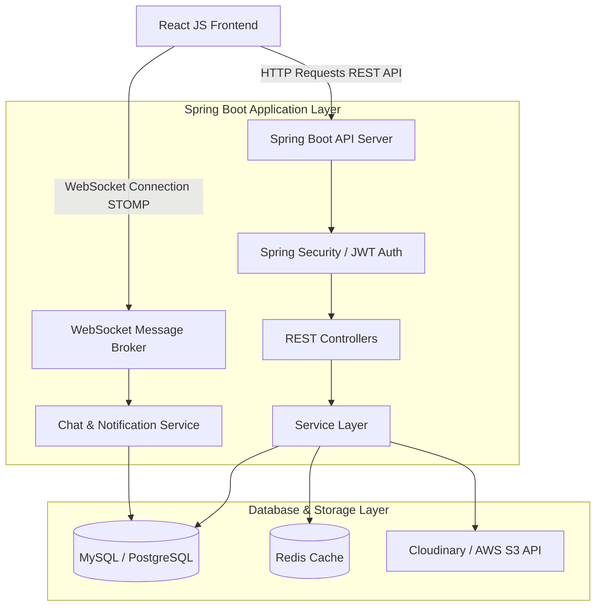

# TÀI LIỆU ĐẶC TẢ YÊU CẦU PHẦN MỀM (SRS) - DỰ ÁN MẠNG XÃ HỘI DESMOS

Tài liệu Đặc tả Yêu cầu Phần mềm này (Software Requirement Specification - SRS) mô tả chi tiết các yêu cầu chức năng, thiết kế cơ sở dữ liệu, đặc tả API và kiến trúc hệ thống cho dự án **Mạng xã hội Desmos**. Dự án sử dụng công nghệ **React JS** cho Frontend và **Java Spring Boot (với JPA/Hibernate, Spring Security, JWT và WebSocket)** cho Backend.

---

## 1. TỔNG QUAN DỰ ÁN (PROJECT OVERVIEW)

### 1.1. Giới thiệu chung
**Desmos** là một nền tảng mạng xã hội trực tuyến cho phép người dùng kết nối, chia sẻ thông tin, tương tác thông qua bài viết, bình luận, bày tỏ cảm xúc và trò chuyện trực tiếp (real-time chat). Hệ thống được thiết kế hướng tới trải nghiệm người dùng mượt mà, giao diện hiện đại và tính năng phản hồi tức thời.

### 1.2. Phạm vi dự án
Hệ thống sẽ triển khai đầy đủ **12 module cốt lõi** phù hợp cho các đồ án môn học hoặc đồ án tốt nghiệp, bao gồm:
1. **Authentication (Xác thực người dùng & JWT)**
2. **User Profile (Hồ sơ cá nhân)**
3. **Friendship (Hệ thống Bạn bè)**
4. **Follow (Hệ thống Theo dõi)**
5. **Post (Bài viết & Chia sẻ, Ghim)**
6. **Post Media (Quản lý hình ảnh/video bài viết)**
7. **Comment (Bình luận & Trả lời bình luận)**
8. **Reaction (Bày tỏ cảm xúc đa dạng)**
9. **Notification (Thông báo Real-time)**
10. **Search (Tìm kiếm nâng cao)**
11. **Chat (WebSocket Real-time)**
12. **Admin (Quản trị hệ thống & Thống kê)**

---

## 2. KIẾN TRÚC HỆ THỐNG (SYSTEM ARCHITECTURE)

Hệ thống được thiết kế theo mô hình **Client-Server** tách biệt hoàn toàn giữa Frontend (React JS) và Backend (Spring Boot), giao tiếp với nhau qua **RESTful API** và **WebSocket (STOMP Protocol)** để cập nhật real-time.



---

## 3. THIẾT KẾ CƠ SỞ DỮ LIỆU CHI TIẾT (DATABASE SCHEMA DESIGN)

Cơ sở dữ liệu được thiết kế tương thích với các Entity Java hiện có trong dự án, bổ sung thêm các bảng phục vụ cho tính năng Theo dõi (Follow) và Chat (WebSocket).

### 3.1. Các bảng đã tồn tại trong mã nguồn (Entity-based)

#### Bảng `users` (Entity: [User.java](file:///e:/My%20Project/desmos/backend/src/main/java/com/example/backend/model/entity/User.java))
Lưu trữ thông tin tài khoản và hồ sơ cá nhân cơ bản của người dùng.
- **Trường dữ liệu:**
  - `id` (BIGINT, Primary Key, Auto Increment)  
  - `username` (VARCHAR(100), Unique, Not Null)
  - `email` (VARCHAR(150), Unique, Not Null)
  - `phone` (VARCHAR(20), Nullable)
  - `password` (VARCHAR(255), Not Null)
  - `avata` (TEXT, Nullable): Đường dẫn ảnh đại diện (Lưu ý: đặt tên đúng biến `avata` trong Entity)
  - `cover_photo` (TEXT, Nullable): Đường dẫn ảnh bìa
  - `bio` (TEXT, Nullable): Tiểu sử giới thiệu ngắn
  - `dod` (DATETIME, Nullable): Ngày sinh (Date of birth)
  - `gender` (VARCHAR(20), Nullable): Giới tính (Enum: `male`, `female`, `other` thông qua [Gender.java](file:///e:/My%20Project/desmos/backend/src/main/java/com/example/backend/model/enums/Gender.java))
  - `role` (VARCHAR(20), Not Null): Quyền hạn (Enum: `admin`, `user`, `qtv` thông qua [Role.java](file:///e:/My%20Project/desmos/backend/src/main/java/com/example/backend/model/enums/Role.java))
  - `is_verified` (BOOLEAN, Default: false): Đã xác thực Email hay chưa
  - `is_active` (BOOLEAN, Default: true): Tài khoản có đang hoạt động không
  - `false_login` (INT, Default: 0): Số lần đăng nhập sai liên tiếp
  - `lock_until` (TIMESTAMP, Nullable): Khóa tài khoản đến thời điểm nào
  - `create_at` (DATETIME, Not Null): Thời gian tạo tài khoản
  - `update_at` (DATETIME, Nullable): Thời gian cập nhật tài khoản
  - `delete_at` (DATETIME, Nullable): Thời gian xóa mềm tài khoản

#### Bảng `posts` (Entity: [Post.java](file:///e:/My%20Project/desmos/backend/src/main/java/com/example/backend/model/entity/Post.java))
Lưu trữ các bài viết được đăng bởi người dùng.
- **Trường dữ liệu:**
  - `id` (BIGINT, Primary Key, Auto Increment)
  - `caption` (TEXT, Nullable): Nội dung văn bản của bài viết
  - `user_id` (BIGINT, Foreign Key referencing `users(id)`)
  - `privacy` (VARCHAR(20), Not Null): Chế độ riêng tư (Enum: `globle`, `only_me`, `friends` thông qua [Privacy.java](file:///e:/My%20Project/desmos/backend/src/main/java/com/example/backend/model/enums/Privacy.java))
  - `status` (VARCHAR(20), Not Null): Trạng thái bài viết (Enum: `draft`, `published`, `deleted` thông qua [PostStatus.java](file:///e:/My%20Project/desmos/backend/src/main/java/com/example/backend/model/enums/PostStatus.java))
  - `create_at` (DATETIME, Not Null)
  - `update_at` (DATETIME, Nullable)
  - `delete_at` (DATETIME, Nullable)

#### Bảng `post_medias` (Entity: [PostMedia.java](file:///e:/My%20Project/desmos/backend/src/main/java/com/example/backend/model/entity/PostMedia.java))
Quản lý các phương tiện (hình ảnh/video) đính kèm trong mỗi bài viết (Hỗ trợ 1 bài đăng có nhiều ảnh/video).
- **Trường dữ liệu:**
  - `id` (BIGINT, Primary Key, Auto Increment)
  - `post_id` (BIGINT, Foreign Key referencing `posts(id)`)
  - `media_url` (TEXT, Not Null): Đường dẫn file trên Cloudinary hoặc S3
  - `media_type` (VARCHAR(20), Not Null): Loại file (Enum: `image`, `video` thông qua [MediaType.java](file:///e:/My%20Project/desmos/backend/src/main/java/com/example/backend/model/enums/MediaType.java))
  - `create_at` (DATETIME, Not Null)
  - `update_at` (DATETIME, Nullable)

#### Bảng `comments` (Entity: [Comment.java](file:///e:/My%20Project/desmos/backend/src/main/java/com/example/backend/model/entity/Comment.java))
Lưu trữ các bình luận và phản hồi bình luận.
- **Trường dữ liệu:**
  - `id` (BIGINT, Primary Key, Auto Increment)
  - `content` (TEXT, Not Null): Nội dung bình luận
  - `user_id` (BIGINT, Foreign Key referencing `users(id)`)
  - `post_id` (BIGINT, Foreign Key referencing `posts(id)`)
  - `comment_id` (BIGINT, Foreign Key referencing `comments(id)`, Nullable): Dùng để trả lời một bình luận cha (Reply)
  - `create_at` (DATETIME, Not Null)
  - `update_at` (DATETIME, Nullable)
  - `delete_at` (DATETIME, Nullable)

#### Bảng `reacts` (Entity: [React.java](file:///e:/My%20Project/desmos/backend/src/main/java/com/example/backend/model/entity/React.java))
Lưu trữ thông tin tương tác cảm xúc đối với bài viết hoặc bình luận.
- **Trường dữ liệu:**
  - `id` (BIGINT, Primary Key, Auto Increment)
  - `reaction` (VARCHAR(20), Not Null): Loại cảm xúc (Enum: `like`, `love`, `haha`, `wow`, `sad`, `angry` thông qua [Reaction.java](file:///e:/My%20Project/desmos/backend/src/main/java/com/example/backend/model/enums/Reaction.java))
  - `user_id` (BIGINT, Foreign Key referencing `users(id)`)
  - `post_id` (BIGINT, Foreign Key referencing `posts(id)`, Nullable)
  - `comment_id` (BIGINT, Foreign Key referencing `comments(id)`, Nullable)
  - `create_at` (DATETIME, Not Null)

#### Bảng `friends` (Entity: [Friend.java](file:///e:/My%20Project/desmos/backend/src/main/java/com/example/backend/model/entity/Friend.java))
Lưu trữ trạng thái mối quan hệ song phương giữa hai người dùng.
- **Trường dữ liệu:**
  - `id` (BIGINT, Primary Key, Auto Increment)
  - `user1_id` (BIGINT, Foreign Key referencing `users(id)`)
  - `user2_id` (BIGINT, Foreign Key referencing `users(id)`)
  - `status` (VARCHAR(20), Not Null): Trạng thái (Enum: `none`, `pending`, `friend`, `block` thông qua [FriendStatus.java](file:///e:/My%20Project/desmos/backend/src/main/java/com/example/backend/model/enums/FriendStatus.java))
  - `create_at` (DATETIME, Not Null)
  - `update_at` (DATETIME, Nullable)
  - `delete_at` (DATETIME, Nullable)

#### Bảng `friend_ships` (Entity: [Friendship.java](file:///e:/My%20Project/desmos/backend/src/main/java/com/example/backend/model/entity/Friendship.java))
Lưu trữ các yêu cầu gửi kết bạn đang chờ phản hồi từ người gửi đến người nhận.
- **Trường dữ liệu:**
  - `id` (BIGINT, Primary Key, Auto Increment)
  - `sender_id` (BIGINT, Foreign Key referencing `users(id)`)
  - `receiver_id` (BIGINT, Foreign Key referencing `users(id)`)
  - `create_at` (DATETIME, Not Null)

#### Bảng `shares` (Entity: [Share.java](file:///e:/My%20Project/desmos/backend/src/main/java/com/example/backend/model/entity/Share.java))
Lưu trữ thông tin người dùng chia sẻ bài viết khác về dòng thời gian của họ.
- **Trường dữ liệu:**
  - `id` (BIGINT, Primary Key, Auto Increment)
  - `caption` (TEXT, Nullable): Nội dung đi kèm khi chia sẻ
  - `user_id` (BIGINT, Foreign Key referencing `users(id)`)
  - `post_id` (BIGINT, Foreign Key referencing `posts(id)`)
  - `create_at` (DATETIME, Not Null)
  - `update_at` (DATETIME, Nullable)

#### Bảng `hastags` (Entity: [Hastag.java](file:///e:/My%20Project/desmos/backend/src/main/java/com/example/backend/model/entity/Hastag.java))
Lưu trữ các nhãn hashtag đi kèm trong các bài viết.
- **Trường dữ liệu:**
  - `id` (BIGINT, Primary Key, Auto Increment)
  - `type` (VARCHAR(100), Not Null): Tên hashtag (ví dụ: `java`, `travel`)
  - `post_id` (BIGINT, Foreign Key referencing `posts(id)`)

#### Bảng `notifications` (Entity: [Notification.java](file:///e:/My%20Project/desmos/backend/src/main/java/com/example/backend/model/entity/Notification.java))
Quản lý các thông báo trong hệ thống.
- **Trường dữ liệu:**
  - `id` (BIGINT, Primary Key, Auto Increment)
  - `message` (TEXT, Not Null): Nội dung thông báo hiển thị
  - `type` (VARCHAR(50), Not Null): Loại thông báo (Enum: `FRIEND_REQUEST`, `FRIEND_ACCEPTED`, `POST_LIKE`, `POST_COMMENT`, `POST_SHARE`, `POST_TAG`, `REACTION`, `COMMENT_REPLY` thông qua [NotificationType.java](file:///e:/My%20Project/desmos/backend/src/main/java/com/example/backend/model/enums/NotificationType.java))
  - `isRead` (BOOLEAN, Default: false): Trạng thái đã xem hay chưa
  - `action` (VARCHAR(100), Default: 'system'): Hành vi hoặc đường dẫn liên kết khi nhấn vào thông báo
  - `user_id` (BIGINT, Foreign Key referencing `users(id)`): Người nhận thông báo
  - `target_Id` (BIGINT, Nullable): ID của đối tượng liên quan (ví dụ: `post_id`, `comment_id`, `user_id`)
  - `createdAt` (DATETIME, Not Null)

---

### 3.2. Các bảng bổ sung để hoàn thành hệ thống (Proposed Schema)

#### Bảng `follows` (Quản lý lượt theo dõi)
Hệ thống theo dõi một chiều (Follow) độc lập với kết bạn.
- **Trường dữ liệu:**
  - `id` (BIGINT, Primary Key, Auto Increment)
  - `follower_id` (BIGINT, Foreign Key referencing `users(id)`): Người thực hiện hành vi theo dõi
  - `following_id` (BIGINT, Foreign Key referencing `users(id)`): Người được theo dõi
  - `create_at` (DATETIME, Not Null)
- **Constraint:** Unique composite key (`follower_id`, `following_id`) để không follow lặp.

#### Bảng `conversations` (Quản lý cuộc hội thoại Chat)
Lưu trữ thông tin phòng chat (bao gồm chat 1-1 và chat nhóm).
- **Trường dữ liệu:**
  - `id` (BIGINT, Primary Key, Auto Increment)
  - `name` (VARCHAR(255), Nullable): Tên phòng chat (chỉ dùng cho chat nhóm)
  - `is_group` (BOOLEAN, Default: false): Đánh dấu cuộc trò chuyện có phải là nhóm hay không
  - `creator_id` (BIGINT, Foreign Key referencing `users(id)`, Nullable): Người sáng lập nhóm chat
  - `create_at` (DATETIME, Not Null)
  - `update_at` (DATETIME, Nullable): Cập nhật khi có tin nhắn mới nhất để sắp xếp danh sách chat

#### Bảng `conversation_members` (Thành viên nhóm chat)
Mối quan hệ nhiều-nhiều giữa phòng chat và người dùng.
- **Trường dữ liệu:**
  - `conversation_id` (BIGINT, Foreign Key referencing `conversations(id)`)
  - `user_id` (BIGINT, Foreign Key referencing `users(id)`)
  - `joined_at` (DATETIME, Not Null)
- **Constraint:** Primary Key (`conversation_id`, `user_id`)

#### Bảng `messages` (Tin nhắn)
Lưu trữ toàn bộ nội dung tin nhắn gửi trong phòng chat.
- **Trường dữ liệu:**
  - `id` (BIGINT, Primary Key, Auto Increment)
  - `conversation_id` (BIGINT, Foreign Key referencing `conversations(id)`)
  - `sender_id` (BIGINT, Foreign Key referencing `users(id)`)
  - `content` (TEXT, Nullable): Nội dung tin nhắn văn bản
  - `media_url` (TEXT, Nullable): Đường dẫn hình ảnh/tệp đính kèm trong tin nhắn
  - `emoji` (VARCHAR(50), Nullable): Ký hiệu Emoji gửi nhanh
  - `is_recalled` (BOOLEAN, Default: false): Đánh dấu tin nhắn bị thu hồi bởi người gửi
  - `create_at` (DATETIME, Not Null)

#### Bảng `message_status` (Theo dõi trạng thái "Đã xem - Seen")
Quản lý trạng thái đọc tin nhắn của từng thành viên trong cuộc hội thoại.
- **Trường dữ liệu:**
  - `message_id` (BIGINT, Foreign Key referencing `messages(id)`)
  - `user_id` (BIGINT, Foreign Key referencing `users(id)`)
  - `is_seen` (BOOLEAN, Default: false)
  - `seen_at` (DATETIME, Nullable)
- **Constraint:** Primary Key (`message_id`, `user_id`)

---

## 4. CHI TIẾT YÊU CẦU CHỨC NĂNG (12 MODULES)

### Module 1: Authentication (Xác thực & Phân quyền)
- **Đăng ký (Sign Up):** 
  - Khách truy cập cung cấp Email, Username, Mật khẩu, Số điện thoại để đăng ký tài khoản.
  - Hệ thống kiểm tra trùng lặp email và username.
  - Mã hóa mật khẩu bằng BCrypt trước khi lưu.
- **Xác thực email (Email Verification):** 
  - Gửi mã OTP hoặc liên kết kích hoạt qua email đã đăng ký.
  - Đổi trạng thái `is_verified = true` khi xác thực thành công.
- **Đăng nhập (Sign In):** 
  - Đăng nhập bằng Email/Username và Mật khẩu.
  - Nếu thành công, hệ thống sinh mã **JWT Token (Access Token & Refresh Token)** trả về cho Client.
  - Nếu sai mật khẩu quá 5 lần (`false_login >= 5`), khóa tài khoản tạm thời (`lock_until = hiện tại + 15 phút`).
- **Quên mật khẩu (Forgot Password):** 
  - Người dùng nhập Email, hệ thống xác nhận và gửi mã OTP đặt lại mật khẩu.
- **Đổi mật khẩu (Change Password):**
  - Người dùng đã đăng nhập nhập mật khẩu cũ và mật khẩu mới để thay đổi.
- **Đăng xuất (Sign Out):** 
  - Hủy token phía Client, tùy chọn lưu danh sách đen (Blacklist Token) ở Redis phía Server.

### Module 2: User Profile (Hồ sơ cá nhân)
- **Xem hồ sơ:**
  - Hiển thị thông tin cá nhân của người dùng gồm: Avatar, Ảnh bìa, Họ tên/Username, Tiểu sử (Bio), Công việc, Học vấn, Ngày sinh (dod), Giới tính, danh sách bài viết đã đăng, danh sách bạn bè.
- **Chỉnh sửa hồ sơ:**
  - Người dùng cập nhật các trường: Bio, Công việc, Học vấn, Ngày sinh, Giới tính.
- **Thay đổi Avatar và Ảnh bìa:**
  - Tải ảnh lên và gọi API lưu URL ảnh vào trường `avata` và `cover_photo` của bảng `users`.

### Module 3: Friendship (Kết bạn)
- **Gửi lời mời kết bạn (Send Friend Request):**
  - Người dùng A nhấn kết bạn với B. Hệ thống tạo dòng ghi trong `friend_ships` với `sender_id = A, receiver_id = B`, đồng thời tạo bản ghi trong `friends` với `status = 'pending'`.
  - Không được tự kết bạn với chính mình hoặc khi đã là bạn bè.
- **Chấp nhận lời mời (Accept Request):**
  - Người dùng B nhấn chấp nhận lời mời của A. Hệ thống xóa bản ghi ở `friend_ships`, cập nhật `status = 'friend'` trong bảng `friends`.
- **Từ chối / Hủy lời mời (Reject / Cancel Request):**
  - Từ chối (B từ chối A) hoặc Hủy (A rút lại lời mời gửi B) -> Xóa dòng trong `friend_ships` và đổi `status = 'none'` (hoặc xóa mềm) trong `friends`.
- **Hủy kết bạn (Unfriend):**
  - Hủy mối quan hệ bạn bè giữa A và B -> Cập nhật `status = 'none'` và xóa liên kết.
- **Chặn & Bỏ chặn (Block / Unblock):**
  - Người dùng A chặn người dùng B -> Đổi trạng thái mối quan hệ thành `status = 'block'` trong bảng `friends` với quy định rõ ràng về hướng chặn (không cho phép B xem bài viết, nhắn tin hay tương tác với A).

### Module 4: Follow (Theo dõi)
- **Theo dõi (Follow):**
  - Người dùng A nhấn Theo dõi người dùng B -> Thêm bản ghi vào bảng `follows`.
  - Hệ thống tự động thêm theo dõi khi hai người kết bạn thành công.
- **Bỏ theo dõi (Unfollow):**
  - Người dùng A bỏ theo dõi B -> Xóa bản ghi tương ứng khỏi bảng `follows`.
- **Nghiệp vụ bổ sung:**
  - Bảng tin (News Feed) của người dùng sẽ ưu tiên hiển thị bài viết từ những người dùng họ đang theo dõi (Following) ở chế độ công khai (`globle`) hoặc bạn bè (`friends`).

### Module 5: Post (Bài viết)
- **Đăng bài viết (Create Post):**
  - Cho phép người dùng nhập nội dung văn bản (caption), chọn chế độ riêng tư (Privacy: `globle` - Công khai, `friends` - Bạn bè, `only_me` - Chỉ mình tôi), đính kèm danh sách hình ảnh/video.
- **Sửa bài viết (Edit Post):**
  - Người dùng có thể sửa lại caption, thay đổi chế độ riêng tư của bài viết thuộc quyền sở hữu của họ.
- **Xóa bài viết (Delete Post):**
  - Thực hiện xóa mềm bài viết bằng cách cập nhật `status = 'deleted'` và đặt giá trị cho cột `delete_at`. Bài viết sẽ không hiển thị trên dòng thời gian và bảng tin nữa.
- **Chia sẻ bài viết (Share Post):**
  - Người dùng chia sẻ bài viết của người khác về tường của mình. Tạo bản ghi mới trong bảng `shares` liên kết giữa người dùng thực hiện chia sẻ và bài viết gốc kèm theo bình luận bổ sung (caption).
- **Ghim bài viết (Pin Post):**
  - Cho phép người dùng ghim tối đa 1 bài viết lên đầu trang cá nhân để người khác dễ dàng nhìn thấy.

### Module 6: Post Media (Quản lý phương tiện bài viết)
- **Upload File:**
  - Hệ thống tích hợp một Service lưu trữ đám mây (Cloudinary hoặc AWS S3).
  - Khi đăng bài kèm ảnh/video, Frontend upload ảnh lên Cloudinary lấy về URL bảo mật bảo đảm, sau đó gửi danh sách URL này kèm loại phương tiện (`image`, `video`) về cho REST API đăng bài viết.
  - Lưu thông tin vào bảng `post_medias` liên kết tới `posts`.
- **Ràng buộc định dạng:**
  - Ảnh: hỗ trợ `.jpg`, `.jpeg`, `.png`, `.gif` (dung lượng tối đa 5MB/ảnh).
  - Video: hỗ trợ `.mp4`, `.mov` (dung lượng tối đa 20MB/video, giới hạn thời lượng).

### Module 7: Comment (Bình luận & Phản hồi)
- **Thêm bình luận (Create Comment):**
  - Người dùng viết bình luận dưới bài viết mà họ có quyền xem.
- **Sửa / Xóa bình luận:**
  - Người viết bình luận có quyền sửa hoặc xóa bình luận của mình. Chủ bài viết cũng có quyền xóa mọi bình luận trong bài viết của mình.
- **Phản hồi bình luận (Reply Comment):**
  - Người dùng trả lời một bình luận khác. Khi đó, bản ghi `comments` mới sẽ lưu `comment_id` tham chiếu đến `id` của bình luận cha. Giới hạn độ sâu phân cấp bình luận tối đa là 2 cấp để tối ưu hóa trải nghiệm giao diện.

### Module 8: Reaction (Bày tỏ cảm xúc)
- **Đánh giá cảm xúc:**
  - Người dùng bày tỏ cảm xúc (`like`, `love`, `haha`, `wow`, `sad`, `angry`) trên Bài viết hoặc Bình luận.
- **Cập nhật động:**
  - Nếu người dùng đã thả cảm xúc trước đó mà nhấn cảm xúc khác -> Thay đổi loại cảm xúc trong bảng `reacts`.
  - Nếu nhấn trùng cảm xúc cũ -> Xóa cảm xúc đó khỏi bảng (Undo React).

### Module 9: Notification (Thông báo)
- **Sự kiện tạo thông báo:**
  - Gửi thông báo đến người nhận khi có các sự kiện: Được gửi lời mời kết bạn (`FRIEND_REQUEST`), Được đồng ý kết bạn (`FRIEND_ACCEPTED`), Bài viết được thích (`POST_LIKE` / `REACTION`), Có người bình luận (`POST_COMMENT`), Phản hồi bình luận (`COMMENT_REPLY`), Được chia sẻ bài viết (`POST_SHARE`), hoặc được gắn thẻ (`POST_TAG`).
- **Gửi nhận Real-time:**
  - Tích hợp WebSocket. Khi có thông báo mới, hệ thống tự động đẩy thông điệp JSON tới kênh đăng ký của người nhận (ví dụ: `/topic/notifications/{userId}`). Nếu người dùng không online, thông báo vẫn được lưu vào database và tải lại khi người dùng đăng nhập.

### Module 10: Search (Tìm kiếm nâng cao)
- **Tìm kiếm người dùng:**
  - Tìm theo từ khóa trùng khớp một phần với username, email hoặc tên đầy đủ của người dùng.
- **Tìm kiếm bài viết:**
  - Tìm kiếm bài viết có chế độ công khai (`globle`) chứa từ khóa trong caption.
- **Tìm kiếm Hashtag:**
  - Tìm kiếm các bài viết được gắn thẻ tag tương ứng (liên kết qua bảng `hastags`).

### Module 11: Chat (WebSocket Real-time)
- **Giao thức và kết nối:**
  - Sử dụng Spring WebSocket với giao thức STOMP để truyền tải tin nhắn tức thời.
- **Chat 1-1 & Chat nhóm:**
  - Tạo phòng chat (`conversations`), thêm thành viên (`conversation_members`).
  - Gửi tin nhắn (`messages`) chứa văn bản, ảnh (`media_url`) hoặc Emoji.
- **Trạng thái xem tin nhắn (Seen):**
  - Khi người nhận mở phòng chat, gửi sự kiện WebSocket cập nhật trạng thái đã xem (`is_seen = true`) trong bảng `message_status` cho tin nhắn mới nhất, đồng bộ hiển thị biểu tượng "Đã xem" tới người gửi.
- **Thu hồi tin nhắn (Recall):**
  - Người gửi có thể thu hồi tin nhắn trong vòng 24 giờ kể từ khi gửi -> cập nhật `is_recalled = true`. Giao diện hiển thị tin nhắn này dưới dạng "Tin nhắn đã bị thu hồi".

### Module 12: Admin (Quản trị & Thống kê)
- **Quản lý người dùng:**
  - Danh sách người dùng, tìm kiếm, lọc theo trạng thái hoạt động.
  - Khóa tài khoản (`is_active = false`) hoặc kích hoạt lại tài khoản người dùng vi phạm tiêu chuẩn cộng đồng.
- **Quản lý bài viết:**
  - Xem danh sách toàn bộ bài đăng, lọc theo mức độ vi phạm hoặc báo cáo.
  - Xóa các bài viết có nội dung không phù hợp (đổi trạng thái bài viết thành `status = 'deleted'`).
- **Báo cáo thống kê:**
  - Thống kê tổng số lượng: Người dùng mới đăng ký, Số lượng bài viết được tạo, Tổng số lượng tương tác (like, comment) theo khoảng thời gian (ngày/tuần/tháng) dưới dạng biểu đồ số liệu trực quan.

---

## 5. ĐẶC TẢ API ENDPOINTS CƠ BẢN (API SPECIFICATION)

Tất cả các API RESTful đều sử dụng tiền tố `/api/v1` và yêu cầu Header `Authorization: Bearer <JWT_TOKEN>` (ngoại trừ các endpoint public như đăng ký, đăng nhập).

### 5.1. Authentication APIs
| Method | Endpoint | Auth | Mô tả |
| :--- | :--- | :--- | :--- |
| `POST` | `/api/v1/auth/register` | Public | Đăng ký tài khoản mới |
| `POST` | `/api/v1/auth/login` | Public | Đăng nhập và nhận về JWT Token |
| `POST` | `/api/v1/auth/logout` | Required | Đăng xuất hệ thống |
| `POST` | `/api/v1/auth/verify-email` | Public | Xác thực OTP đăng ký tài khoản |
| `POST` | `/api/v1/auth/forgot-password` | Public | Yêu cầu khôi phục mật khẩu qua Email |
| `PUT` | `/api/v1/auth/change-password` | Required | Đổi mật khẩu tài khoản |

### 5.2. Profile APIs
| Method | Endpoint | Auth | Mô tả |
| :--- | :--- | :--- | :--- |
| `GET` | `/api/v1/users/profile/{username}` | Required | Lấy thông tin hồ sơ của người dùng bất kỳ |
| `PUT` | `/api/v1/users/profile` | Required | Cập nhật thông tin chi tiết hồ sơ cá nhân |
| `POST` | `/api/v1/users/profile/avatar` | Required | Cập nhật ảnh đại diện (Multipart File) |
| `POST` | `/api/v1/users/profile/cover` | Required | Cập nhật ảnh bìa (Multipart File) |

### 5.3. Friendship & Follow APIs
| Method | Endpoint | Auth | Mô tả |
| :--- | :--- | :--- | :--- |
| `POST` | `/api/v1/friends/request/{receiverId}` | Required | Gửi lời mời kết bạn |
| `PUT` | `/api/v1/friends/accept/{senderId}` | Required | Đồng ý kết bạn |
| `PUT` | `/api/v1/friends/reject/{senderId}` | Required | Từ chối lời mời kết bạn |
| `DELETE` | `/api/v1/friends/unfriend/{friendId}` | Required | Hủy kết bạn |
| `POST` | `/api/v1/friends/block/{userId}` | Required | Chặn người dùng |
| `POST` | `/api/v1/follows/{userId}` | Required | Theo dõi một người dùng |
| `DELETE` | `/api/v1/follows/{userId}` | Required | Bỏ theo dõi một người dùng |

### 5.4. Post & Media APIs
| Method | Endpoint | Auth | Mô tả |
| :--- | :--- | :--- | :--- |
| `POST` | `/api/v1/posts` | Required | Tạo bài viết mới (kèm link ảnh/video) |
| `PUT` | `/api/v1/posts/{postId}` | Required | Chỉnh sửa nội dung hoặc quyền riêng tư bài viết |
| `DELETE` | `/api/v1/posts/{postId}` | Required | Xóa mềm bài viết |
| `POST` | `/api/v1/posts/share/{postId}` | Required | Chia sẻ bài viết khác về tường |
| `PUT` | `/api/v1/posts/pin/{postId}` | Required | Ghim bài viết lên đầu trang cá nhân |
| `GET` | `/api/v1/posts/feed` | Required | Lấy danh sách bài viết trên Bảng tin (Phân trang) |

### 5.5. Comment & Reaction APIs
| Method | Endpoint | Auth | Mô tả |
| :--- | :--- | :--- | :--- |
| `POST` | `/api/v1/comments` | Required | Viết bình luận cho bài viết |
| `PUT` | `/api/v1/comments/{commentId}` | Required | Chỉnh sửa nội dung bình luận |
| `DELETE` | `/api/v1/comments/{commentId}` | Required | Xóa bình luận |
| `POST` | `/api/v1/reacts` | Required | Bày tỏ / Đổi / Hủy cảm xúc bài viết/bình luận |

### 5.6. Search & Notification APIs
| Method | Endpoint | Auth | Mô tả |
| :--- | :--- | :--- | :--- |
| `GET` | `/api/v1/search` | Required | Tìm kiếm người dùng, bài viết hoặc hashtag |
| `GET` | `/api/v1/notifications` | Required | Danh sách thông báo cá nhân (Phân trang) |
| `PUT` | `/api/v1/notifications/{notiId}/read` | Required | Đánh dấu thông báo là đã đọc |

### 5.7. Chat Websocket Events (STOMP Broker)
- **Đăng ký nhận tin nhắn (Subscription):**
  - `/topic/chat/{conversationId}`: Nhận tin nhắn trong cuộc hội thoại cụ thể.
  - `/queue/notifications-{userId}`: Nhận thông báo đẩy thời gian thực của cá nhân.
- **Gửi tin nhắn (Publish Destination):**
  - `/app/chat.sendMessage`: Gửi tin nhắn mới lên Server điều phối.
  - `/app/chat.seenMessage`: Gửi sự kiện cập nhật trạng thái đã xem tin nhắn.
  - `/app/chat.recallMessage`: Gửi sự kiện thu hồi tin nhắn.

---

## 6. HƯỚNG DẪN TRIỂN KHAI FRONTEND (REACT FE RECOMMENDATIONS)

Để thiết kế một giao diện chuyên nghiệp, đẳng cấp giúp thu hút người dùng ngay từ cái nhìn đầu tiên (WOW factor), Frontend sử dụng React cần tuân thủ các hướng dẫn sau:

### 6.1. Giao diện (UI/UX) Sleek & Premium
- **Hệ màu chủ đạo (Color Palette):**
  - Sử dụng chế độ **Dark Mode** làm mặc định hoặc chuyển đổi mượt mà (Smooth Theme Toggle).
  - Màu nền: Dark Slate/Deep Obsidian (`#0F172A` hoặc `#0B0F19`).
  - Màu sắc thương hiệu (Primary Accent): Neon Blue (`#3B82F6`), Neon Cyan (`#06B6D4`) hoặc Amethyst Violet (`#8B5CF6`).
  - Sử dụng kỹ thuật **Glassmorphism** (nền mờ đục với lớp bóng nhẹ `backdrop-filter: blur(10px)`) cho thanh điều hướng và hộp thoại điều khiển.
- **Kiểu chữ (Typography):**
  - Nhúng Google Fonts cao cấp như **Inter** hoặc **Outfit**. Tránh dùng font mặc định của hệ thống.
- **Hiệu ứng chuyển động (Micro-animations):**
  - Hover các nút bấm: Phóng to nhẹ (`scale-105`), phát sáng viền mờ (glow effect).
  - Sử dụng thư viện **Framer Motion** để tạo hiệu ứng trượt/mờ nhẹ khi tải trang hoặc mở popup.
  - Hiệu ứng Skeleton Loader chất lượng cao trong thời gian chờ gọi API thay vì vòng xoay Loading nhàm chán.

### 6.2. Cấu trúc thư mục khuyên dùng trong React
```text
src/
├── assets/             # Hình ảnh, icon tĩnh của hệ thống
├── components/         # Các thành phần giao diện dùng chung (Button, Input, Card, Modal)
│   ├── Common/
│   ├── Post/
│   ├── Chat/
│   └── Notification/
├── context/            # Quản lý Context (AuthContext, ThemeContext, SocketContext)
├── hooks/              # Custom hooks (useAuth, useSocket, useIntersectionObserver)
├── layouts/            # Cấu trúc trang (Sidebar, Navbar, ChatLayout)
├── pages/              # Các trang chính (Home, Profile, Login, AdminDashboard)
├── services/           # Axios Interceptor để gọi REST API
├── store/              # State management (Redux Toolkit)
└── utils/              # Các hàm bổ trợ xử lý định dạng thời gian, định dạng chuỗi
```

### 6.3. Tích hợp WebSocket với StompJS & SockJS
Triển khai kết nối bền vững thông qua Custom Hook để dễ dàng tái sử dụng trong các Component Chat và Notification:

```javascript
import { useEffect, useState, createContext, useContext } from 'react';
import SockJS from 'sockjs-client';
import { Stomp } from '@stomp/stomp-js';

const SocketContext = createContext(null);

export const SocketProvider = ({ children }) => {
    const [stompClient, setStompClient] = useState(null);
    const [connected, setConnected] = useState(false);

    useEffect(() => {
        const socket = new SockJS('http://localhost:8080/ws');
        const client = Stomp.over(socket);

        client.connect({}, (frame) => {
            setConnected(true);
            setStompClient(client);
            console.log('Connected to WebSocket: ' + frame);
        }, (error) => {
            console.error('WebSocket Error: ', error);
        });

        return () => {
            if (client && client.connected) {
                client.disconnect();
            }
        };
    }, []);

    return (
        <SocketContext.Provider value={{ stompClient, connected }}>
            {children}
        </SocketContext.Provider>
    );
};

export const useSocket = () => useContext(SocketContext);
```

---

## 7. YÊU CẦU PHI CHỨC NĂNG (NON-FUNCTIONAL REQUIREMENTS)

- **Bảo mật (Security):**
  - Mật khẩu người dùng bắt buộc mã hóa bằng **BCrypt**.
  - Áp dụng cơ chế **JWT Auth** với thời hạn Access Token ngắn (15-30 phút) và Refresh Token dài (7-30 ngày).
  - Chống lỗ hổng SQL Injection bằng cách sử dụng Spring Data JPA Repository (Parameter Binding).
  - Lọc dữ liệu đầu vào chống tấn công XSS và bảo mật CORS chỉ cho phép Frontend React đã xác minh truy cập.
- **Tính khả dụng (Usability):**
  - Thiết kế thích ứng (Responsive Layout) hỗ trợ hiển thị hoàn hảo trên các thiết bị di động (Mobile), máy tính bảng (Tablet) và máy tính để bàn (Desktop).
- **Hiệu năng & Khả năng mở rộng (Performance & Scalability):**
  - Phân trang (Pagination) bắt buộc cho tất cả API trả về danh sách lớn (Bảng tin, bình luận, tin nhắn cũ).
  - Sử dụng cơ chế Lazy Loading cho các ảnh đính kèm bài đăng giúp tối ưu dung lượng tải trang.
  - Sử dụng Redis để lưu cache các dữ liệu ít thay đổi hoặc cần truy cập nhanh (Ví dụ: số lượng like, danh sách hashtag hot, thông tin phiên đăng nhập).
